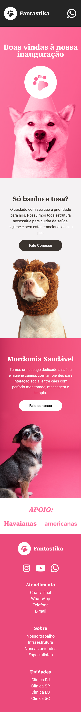

# 🐾 Fantastika

Uma "landing page" de uma rede de pet shops fictícia chamada "Fantastika".

## 📚 Tabela de Conteúdos

- [🐾 Fantastika](#-fantastika)
  - [📚 Tabela de Conteúdos](#-tabela-de-conteúdos)
  - [📋 Descrição](#-descrição)
    - [🚀 Funcionalidades](#-funcionalidades)
    - [🌐 Acesso](#-acesso)
    - [📸 Prévia](#-prévia)
  - [⚙️ Construção](#️-construção)
    - [💻 Tecnologias](#-tecnologias)
    - [🛠️ Ferramentas](#️-ferramentas)
    - [📌 Versão](#-versão)
  - [✏️ Aprendizado](#️-aprendizado)
  - [✒️ Autores](#️-autores)
  - [🎁 Agradecimentos](#-agradecimentos)
  - [📨 Contato](#-contato)

## 📋 Descrição

Este é um projeto de uma "landing page" de uma rede de pet shops fictícia chamada "Fantastika".
Esse projeto foi lançado como o desafio 04 do módulo 01 do curso de front-end do "Vai na Web", e também foi desafio final do módulo 01. Sua principal proposta era colocar todos os conhecimentos repassados ao longo do módulo para a construção de uma página web com HTML5 e CSS3 simples, eficiente, atrativa e  responsiva. O modelo a ser seguido foi apresentado na plataforma de design "Adobe XD".

### 🚀 Funcionalidades

As funcionalidades disponíveis para os usuários estão listadas abaixo:

- Clicar em botões especiais
- Utilizar a página web em qualquer celular de forma simples, intuitiva e com uma excelente visualização

### 🌐 Acesso

🖇️ [Clique aqui para acessar o projeto](https://milton-salgado.github.io/fantastika/)

### 📸 Prévia

  
  

## ⚙️ Construção

Resumo geral dos recursos utilizados na construção do projeto.

### 💻 Tecnologias

Tecnologias utilizadas na construção do projeto:

### 🛠️ Ferramentas

Ferramentas utilizadas na construção do projeto:

### 📌 Versão

Utilizei o Git para o controle de versão. 

Versão atual: 1.0 (primeira versão)

## ✏️ Aprendizado

Ao fazer esse projeto, aprendi a:

- Revisar responsividade em projetos web utilizando o @media em CSS
- Fixar o conceito de "mobile-first" para estabelecer responsividade em dispositivos móveis
- Revisar a estilização de elementos para se adaptar de acordo com tipos e tamanhos de tela diferentes
- Compreender a aplicação de espaçamentos específicos com padding e margin no CSS
- Revisar a utilização da propriedade position para posicionar os elementos de acordo com tipos e tamanhos de tela diferentes
- Criar uma "landing page" completa e responsiva com HTML e CSS

## ✒️ Autores

* **Milton Salgado Leandro** - *Todo o Projeto* - [GitHub](https://github.com/milton-salgado)

## 🎁 Agradecimentos

* Agradeço ao instrutor João Pedro Belo e aos facilitadores Merry Esperança e Naiara Souza pelo auxílio no meu processo de aprendizagem e apoio na construção do projeto.
* Agradeço também a você, visitante, por visualizar o meu projeto!

## 📨 Contato

